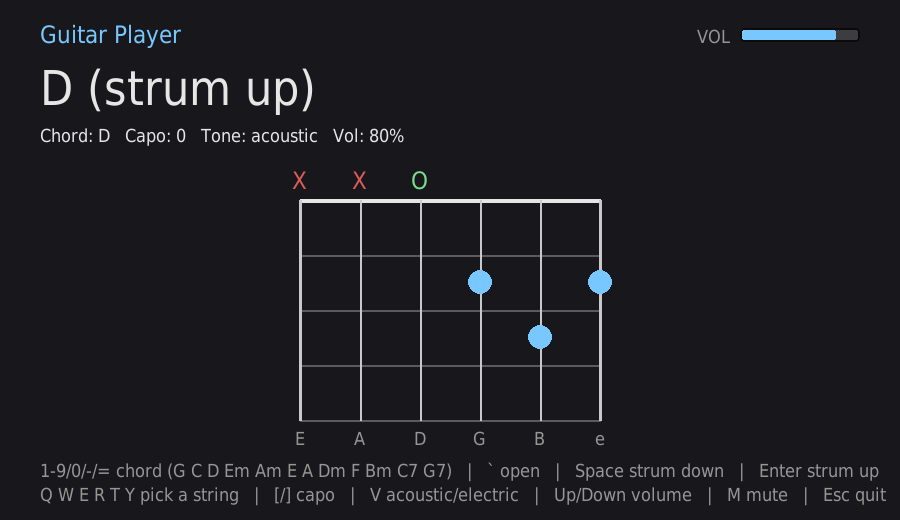

# Guitar Player

[](https://github.com/georgetruong88/guitar-player/actions/workflows/lint.yml)
[](https://github.com/georgetruong88/guitar-player/actions/workflows/build.yml)
[](LICENSE)
[](https://github.com/georgetruong88/guitar-player/actions/workflows/coverage.yml)

Strum chords and pick single strings with your laptop keyboard. A pygame +
numpy toy synth in the same family as [keyboard-piano](../keyboard-piano) —
every string is a real Karplus-Strong plucked-string model, not a sample.



## Controls

| Keys | Action |
|---|---|
| `1` `2` `3` `4` `5` `6` `7` `8` `9` `0` `-` `=` | Select chord: G C D Em Am E A Dm F Bm C7 G7 |
| `` ` `` | Open (no chord — all strings open) |
| `Space` | Strum down (low string to high, like a real downstroke) |
| `Enter` | Strum up (high string to low) |
| `Q` `W` `E` `R` `T` `Y` | Pick a single string (low E, A, D, G, B, high e) |
| `[` / `]` | Capo down / up (0-12 frets) |
| `V` | Toggle acoustic / electric (distorted) tone |
| `Up` / `Down` | Volume up / down |
| `M` | Mute / unmute |
| `Esc` | Quit |

Select a chord, then hit Space or Enter to strum it — the six strings play
in a fast staggered sequence just like a real strum, skipping any muted
strings. Or leave a chord selected and pick out its notes one at a time with
`Q`-`Y` for a melodic line instead of a full chord.

## Run

```sh
pip install pygame numpy
python3 guitar.py
```

## Test

```sh
pip install pytest
python3 -m pytest tests/
```
